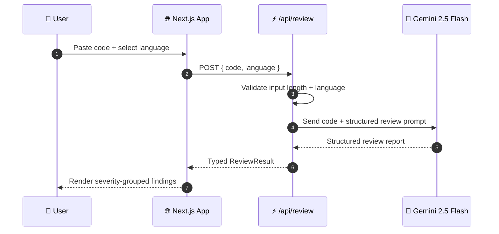

<!-- ═══════════════════════════════════════════════════════════════════════ -->
<!--                          ANIMATED HEADER BANNER                          -->
<!-- ═══════════════════════════════════════════════════════════════════════ -->

<div align="center">


<a href="https://code-review-tool-mu.vercel.app">
  
</a>

<br/>

<a href="https://code-review-tool-mu.vercel.app">
  
</a>
<a href="https://github.com/Abdulgeni/code-review-tool/issues">
  
</a>
<a href="https://github.com/Abdulgeni/code-review-tool/stargazers">
  
</a>

<br/><br/>


</div>

<br/>

<!-- ═══════════════════════════════════════════════════════════════════════ -->

<div align="center">

## 🛡️ What is Sentinel?

**Sentinel** is a generative AI static analysis environment that reviews your code the moment you paste it. It detects **bugs**, **logic errors**, **edge cases**, **security issues**, and **best-practice violations** — then returns a structured, readable report.

No setup. No CI pipeline. No waiting. Just paste and analyze.

<br/>

> *"It doesn't just lint your code. It thinks about it the way a senior engineer would."*

</div>

<br/>

<!-- ═══════════════════════════════════════════════════════════════════════ -->

## ✨ Feature Highlights

<table>
<tr>
<td width="50%" valign="top">

### 🔍 Review Engine
- **Real AI analysis** — Gemini 2.5 Flash, not regex
- **Bug detection** — runtime errors, off-by-one, null derefs
- **Logic errors** — incorrect conditions, dead code
- **Security issues** — injection, unsafe input handling
- **Edge cases** — empty inputs, boundaries, overflow
- **Best practices** — idiomatic patterns per language

</td>
<td width="50%" valign="top">

### 🖥️ User Experience
- **Paste any code** — no file upload needed
- **8+ languages** — JS, TS, Python, Java, C++, Go, Rust, Ruby
- **Structured report** — severity, location, fix suggestion
- **Sample code** — one-click test data per language
- **Graceful fallback** — works even if AI is unavailable
- **Zero-config** — deploy to Vercel in one click

</td>
</tr>
</table>

<br/>

<!-- ═══════════════════════════════════════════════════════════════════════ -->

## 🎬 How It Works



<br/>

<!-- ═══════════════════════════════════════════════════════════════════════ -->

## 🚀 Quick Start

### 1. Clone

```bash
git clone https://github.com/Abdulgeni/code-review-tool.git
cd code-review-tool
```

### 2. Install

```bash
npm install
```

### 3. Configure Environment

Create a `.env.local` file in the project root:

```env
GEMINI_API_KEY=your_gemini_api_key_here
```

> 🔑 Get a **free** API key at **[aistudio.google.com/apikey](https://aistudio.google.com/apikey)**

### 4. Run

```bash
npm run dev
```

Open **[http://localhost:3000](http://localhost:3000)**, paste some code, and hit **Trigger Analysis**. 🎉

<br/>

<!-- ═══════════════════════════════════════════════════════════════════════ -->

## 📁 Project Architecture

```
code-review-tool/
├── app/
│   ├── api/
│   │   └── review/route.ts      ⚡ Code → Gemini → structured report
│   ├── icon.svg                 🛡️ Custom Sentinel favicon
│   ├── layout.tsx               🧩 Root layout + metadata
│   ├── globals.css              🎨 Tailwind base
│   └── page.tsx                 🏠 Landing page
├── components/
│   └── CodeReviewer.tsx         🖥️ Editor + language picker + results
├── lib/
│   └── gemini.ts                🤖 Gemini client + prompt builder
├── public/
├── package.json
└── README.md
```

<br/>

<!-- ═══════════════════════════════════════════════════════════════════════ -->

## 🛠️ Tech Stack

<div align="center">

| Layer | Technology | Purpose |
|:---:|:---:|:---|
| **Framework** |  | App Router, API routes |
| **Language** |  | End-to-end type safety |
| **Styling** |  | Utility-first design system |
| **AI** |  | Code analysis + review generation |
| **SDK** |  | Official Gemini client |
| **Hosting** |  | Edge deployment + CI/CD |

</div>

<br/>

<!-- ═══════════════════════════════════════════════════════════════════════ -->

## 📊 Example Review Output

**Input:** This JavaScript snippet

```javascript
function getUserData(id) {
  fetch('/api/users/' + id)
    .then(res => res.json())
    .then(data => {
      document.getElementById('name').innerHTML = data.name;
    });
}
getUserData(1);
```

**Sentinel's Report:**

```
🔴 CRITICAL — XSS Vulnerability
  Line 5: `innerHTML = data.name` renders unsanitized server data.
  Fix: use `textContent` or sanitize with DOMPurify.

🟠 HIGH — Unhandled Promise Rejection
  Line 2–5: `fetch` has no `.catch()`. Network failure crashes silently.
  Fix: append `.catch(err => console.error(err))`.

🟡 MEDIUM — Missing Input Validation
  Line 1: `id` is never validated. Passing `../admin` could hit unintended routes.
  Fix: validate/encode `id` before concatenation.

🔵 LOW — No Loading or Error State
  The UI gives no feedback while fetching. Consider adding a loading indicator.
```

<br/>

<!-- ═══════════════════════════════════════════════════════════════════════ -->

## 🔌 API Reference

### `POST /api/review`

Analyzes a code snippet and returns a structured review.

**Request** — `application/json`

| Field | Type | Required | Description |
|:---|:---:|:---:|:---|
| `code` | `string` | ✅ | Source code to review |
| `language` | `string` | ✅ | One of: `javascript`, `typescript`, `python`, `java`, `cpp`, `go`, `rust`, `ruby` |

**Example**

```bash
curl -X POST https://code-review-tool-mu.vercel.app/api/review \
  -H "Content-Type: application/json" \
  -d '{"code":"const x = 1","language":"javascript"}'
```

**Response** — `200 OK`

```json
{
  "review": "string — structured markdown report"
}
```

**Errors**

| Status | Meaning |
|:---:|:---|
| `400` | Missing `code` or `language`, or code exceeds max length |
| `500` | Gemini API failure or malformed response |

<br/>

<!-- ═══════════════════════════════════════════════════════════════════════ -->

## 🌐 Deployment

### Deploy to Vercel in 60 seconds

[](https://vercel.com/new/clone?repository-url=https://github.com/Abdulgeni/code-review-tool)

1. Click the button above
2. Add the environment variable `GEMINI_API_KEY`
3. Hit **Deploy**

Vercel handles the build, CDN, and HTTPS automatically.

<br/>

<!-- ═══════════════════════════════════════════════════════════════════════ -->

## 🗺️ Roadmap

- [x] Paste-and-review editor
- [x] Multi-language support (8+ languages)
- [x] Gemini-powered structured reports
- [x] Sample code loader per language
- [x] Graceful fallback when AI is unavailable
- [ ] 📁 File upload / drag-and-drop
- [ ] 🔗 GitHub PR review via URL
- [ ] 📊 Severity scoring + export to PDF
- [ ] 🧪 Auto-fix suggestions with diff view
- [ ] 🌍 Additional languages (Swift, Kotlin, PHP, C#)

<br/>

<!-- ═══════════════════════════════════════════════════════════════════════ -->

## 🤝 Contributing

Contributions are what make open source amazing. Any contribution you make is **genuinely appreciated**.

1. **Fork** the repository
2. **Create** your feature branch
   ```bash
   git checkout -b feature/amazing-feature
   ```
3. **Commit** your changes
   ```bash
   git commit -m "feat: add amazing feature"
   ```
4. **Push** to the branch
   ```bash
   git push origin feature/amazing-feature
   ```
5. **Open** a Pull Request

> 💡 Please follow [Conventional Commits](https://www.conventionalcommits.org/) for commit messages.

<br/>

<!-- ═══════════════════════════════════════════════════════════════════════ -->

## 📜 License

Distributed under the **MIT License**. See [`LICENSE`](LICENSE) for more information.

<br/>

<!-- ═══════════════════════════════════════════════════════════════════════ -->

## 👤 Author

<div align="center">

**Abdulgeni**

<a href="https://github.com/Abdulgeni">
  
</a>

*Built with Next.js, TypeScript, and Google Gemini AI.*

</div>

<br/>

<!-- ═══════════════════════════════════════════════════════════════════════ -->

<div align="center">

### ⭐ If Sentinel caught a bug you would have shipped, give it a star!

<a href="https://github.com/Abdulgeni/code-review-tool/stargazers">
  
</a>

<br/><br/>


</div>